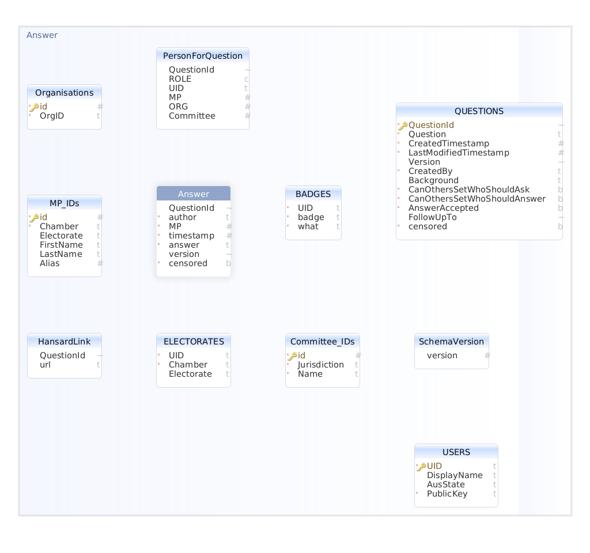
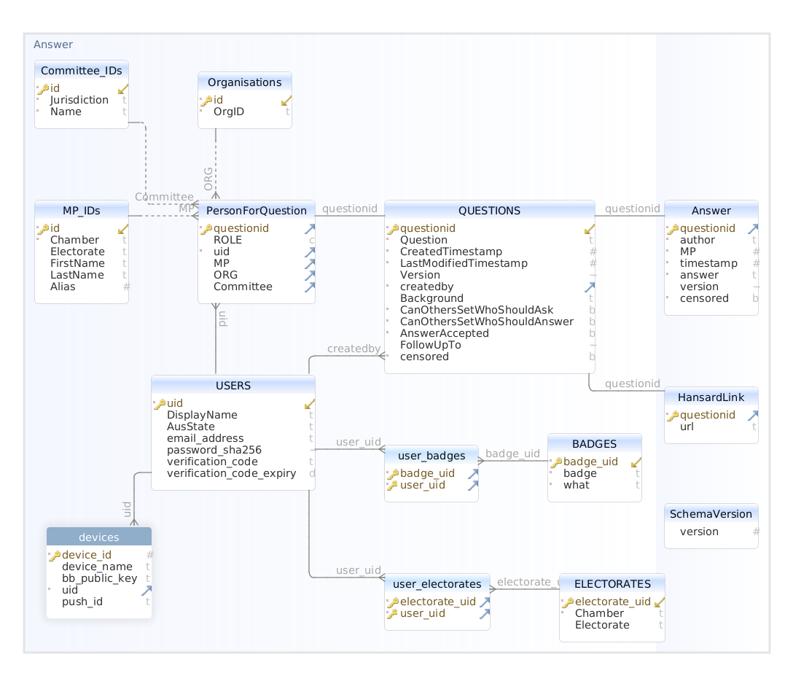

# User Accounts (WP1A)

This report provides a review and recommendations for user management in Right To Ask (RTA). It will cover the following:

* Back-end structure
* Types of accounts and their respective needs
* User registration
  * Including local and federated login
* User Verification
* Account recovery
* Support for E2E DMs
  * Including support for the future implementation of push notifications
* Account Moderation

## Back-end Structure
The current implementation as the following schema for a user:
| Field Name | Field Type | Comments |
| ------------- |:-------------:| :-------------: |
| UID | VARCHAR(30) | PRIMARY KEY NOT NULL
| DisplayName | VARCHAR(60) |  |
| AusState | VARCHAR(3) |  |
| PublicKey | TEXT NOT NULL | For bulletin board access

### Multi-Device Support
Currently the back-end has only partial support for a single user having multiple devices. This is because each user can only have a single PublicKey associated with it. Multiple devices could only be supported if the key pair were synchronised across the devices. This is both difficult to do securely and if the key is eventually stored in a SecureElement will be impossible to do. 

> **Recommendation 1**: The user schema should only contain data that is about the user and should not contain device data. Instead, create a Devices table which is linked to a user via the UID. This allows a one-to-many relationships between the user and their devices. This will also be required to support E2E DMs and Push Notifications, both of which will require device specific identifiers to be stored against a user.

### UID
Currently the UID is equivalent to a username, for example, a handle or email address. Any user selected value should be anticipated to need to change, even if not fully supported on the front-end. For example, if a user selected UID contained a racist term or a swear word. Moderation may looks to remove that from the UID, which would present a problem if that value is being used throughout the database.

> **Recommendation 2**: Change UID to be an internal-only UID that is not displayed to the user. It should be auto-generated to guarantee uniqueness and permanent, i.e. it never changes. As such, UID should be changed to ``INTEGER AUTOINCREMENT``. Any corresponding uses of UID in other tables would also need to be updated.

### Foreign Key Constraints and General Database Structure
The current database schema does not always set primary or foreign key constraints. Such constraints help to maintain both referential integrity, as well as having a possible performance benefit. Specifically, the information provided via key constraints allows the database to optimise linking queries, as well as the searching of tables via the primary key. It also allows the ``ON DELETE CASCADE`` property to be configured. This will automatically delete tables that reference the primary key when deleting the record containing the primary key. For example, delete a user will delete any badges that are associated with that user. This is not automatic, and could be selectively applied. For example, it might not be desirable to delete a question when deleting a user. Although that does need some consideration.

> **For Consideration**: What should occur when a User is deleted or requests to be deleted. Should all of their data be deleted or should only personal information be deleted. Note: this does not impact on whether key constrains should be set, it just impacts on whether a ``ON DELETE CASCADE`` constraint is set.

VT: I'd be inclined not to delete their questions unless we have to - otherwise someone can maliciously gather lots of up-votes (and dissuade others from writing the same question), then delete their account. I am not sure whether some people would feel that the right to deletion is important - we should certainly communicate clearly that you can't delete your questions even if you delete your account.

Whether the primary key should be just an auto-incrementing integer or a UUID is open to some debate.

#### Should a UUID be used as a primary key?
There is some debate about whether UUID's are more desirable than simple integer keys. The advantage of a UUID is that it is globally unique, as such merging databases is possible without the problem of key duplication. Furthermore, if sharding a database across multiple servers UUID will prevent key collisions. Some argue that is offers security benefits, in that a standard auto incrementing integer is susceptible to index attacks, i.e. ID=10 leads to it being obvious that ID's from 1-9 should be tried and 10+. UUID prevent that simple indexing, but their value against brute-force attack are dependent on how they are constructed.

MySQL contains a UUID function that generates a Version 1 UUID, which is based on MAC address and time in nano seconds. As such, there is no 'randomness' to speak of, just a rapidly changing clock. Therefore the indexing attack is not over the entire space, but is in fact bounded by the rate of change caused by the clock. Whilst there is likely to be a security benefit, quantifying that benefit is problematic and therefore should not be relied upon to provide any meaningful protection. If the system is not secure with Integer keys it isn't secure with UUID keys. 

The biggest drawback of using a UUID is that they require considerably more space to store and are potentially difficult to debug and use. For example, a UUID is 16 bytes, whilst an Integer is only 4 bytes. The most efficient way to store a UUID is as a Binary field, however, this requires converting it to characters and back to be able to be human readable, and therefore displayed in any debug logs or used directly in any debug queries.

For a Minimum Viable Product (MVP) there are not sufficient compelling reasons to recommend a UUID. For simplicity a standard auto incrementing integer will suffice.

#### Database Structure
The current database structure is as follows:

Note that no relationships are defined between tables, despite them existing within the schema. This can be resolved with correctly configured key constraints.

The following diagrams shows an updated diagram with the relational links added, as well some deduplication and some additional fields in the User table, which will be discussed in further detail later in this report. Additionally, there are placeholders for a devices table and the the PublicKey has been shifted to the device record. 



Whilst this may look like a lot of changes, most of it is the addition of foreign key constraints. Additionally, linking tables for badges and electorates have been added. Previously each Badge would duplicate the content for each user, when in fact the badge is static and is just awarded to the user. Similar to electorates, there is only one electorate that each user should reference, instead of each user having an entry for that electorate. 

Changes to the existing structure could be achieved using Database Management software like [DBSchema](https://dbschema.com/), from which the entity relationship diagrams were created. The paid for version of DBSchema offers functionality to generate migration scripts. These work by first importing the existing database schema, making the necessary changes, and then exporting the migration scripts. These scripts should handle both the updating of the database structure as well as moving the data over to it. It would need testing in practice, but might provide a starting point for migration. If the database can be discarded and re-initialised, i.e., it is still in testing or development then that would be easier and the more advisable option. 

### User Table
Users has been modified to convert the UID to an auto increment integer. A new field has been added to hold the email address, irrespective or whether it is added manually or retrieved from a federated login. A password_sha256 field has been added to handle local logins. This should contain a 32 byte verification value calculated using the password_salt. Whether the salt is returned to the user for local calculation or the salted hashing is performed on the server remains to be decided. It is possible that these fields are blank depending on how registration is performed. 

The verification_code and verification_code_expiry contain the last randomly generated verification code sent to the user. The expiry should be a time, for example, 30 minutes after the code was generated. When checking the code, if the current time exceeds this expiry the code should be rejected. [_**Note**: implementing this requires careful consideration of daylight saving time if the clock being used for comparison changes with daylight saving time. It is generally easier to use UTC instead of a local timezone for such comparisons. Unix time is derived from UTC, so provided no timezones are applied it should be fine_]


### Sessions
Currently there is no concept of sessions within the back-end or the client app. Traditionally, apps would establish a session with the server though logging in, which would return some form of bearer-token that could be used to authenticate all subsequent requests until the session expires. By contrast, RTA uses the signing of messages as a means for authentication. This is sufficient when dealing with a very limited API, for example, adding a question, accepting an answer etc., however, it presents a problem for user account management. 

For example, if a user wants to change their display name or email address it will be necessary to authenticate both the request to view the current data, and any follow-up requests to change it. It is possible that these requests could be signed as well, but that will make the processing of such requests more computationally expensive due to the signature checking required. 

Currently this is not a problem because of the single device architecture However, once multiple devices are supported it will be necessary to synchronise such data on start-up, since it could have been changed by another device. 

VT: The way it's implemented at the moment is that existing data is stored locally and change requests are signed. Agree this may be a computational burden.

One option for establishing sessions would be to use Mutual Authentication of the TLS connection. The server could act as an internal Certificate Authority that signed certificate requests from the client. As such, when a user registers and generates their key pair they also generate a certificate signing request which is signed to create a certificate including their UID and their device_id.

### TLS 
The current approach to TLS on the server is to have an nginx server that acts as the end-point and then locally redirects requests to Rust. This has some advantages, in that it would allow load balancing by redirecting to different instances. However, the downside is that the end-point occurs prior to the Rust server and as such some additional configuration is needed to access the certificate. The simplest approach is to forward the necessary data via proxy headers, for example, by enabling:

`proxy_set_header X-SSL-Client-S-DN   $ssl_client_escaped_cert;`

This will include an encoded copy of the verified certificate in the headers, which Rust can then extract use to determine the client ID. 

It is not always necessary to send the entire certificate. It is possible to extract various parts from the certificate for efficiency using headers like the following:

```
proxy_set_header X-SSL-Client-Serial $ssl_client_serial;
proxy_set_header X-SSL-Client-Verify $ssl_client_verify;
proxy_set_header X-SSL-Client-S-DN   $ssl_client_s_dn;
```

The Rust process to check that `X-SSL-Client-Verify=="SUCCESS` which determines if the mutual TLS was successful. Note, this will be essential because nginx may need to be configured to allow failed mTLS connections through for some requests, as such, `X-SSL-Client-Verify` may not always be SUCCESS.

The reason failed mTLS connections may need to be allowed through is to allow the initial registration request through, in which the mTLS has not yet been configured for that client. An alternative, and better albeit more complicated option would be to configure different locations with different settings. One would be specifically for registration in which failed mTLS connections would be accepted and passed on to Rust. Whilst the general location for all other requests would enforce successful mTLS and reject any connections that fail. For redundancy the `X-SSL-Client-Verify` should be checked in any case to protected against nginx misconfiguration. 

#### TLS Sessions
TLS sessions would work by extracting a unique ID from the client certificate and using that as the index to a session store held on the server. Note, it is advisable to use a device specific identifier, not a user identifier. Otherwise a user accessing the service with two different devices will create a session collision, i.e. they will have one session shared between them which will create problems for future functionality like pagination. A good option would be to use a double index in the session store. The first level would be the user ID, extracted from the certificate DN, and the second would the certificate serial number, which is device specific due to different certificates being used on each device. 

I would suggest implementing the session store using [memcached](https://www.memcached.org/). This provides a key value store, which is supported in [Rust](https://docs.rs/memcache/latest/memcache/). It provides object storage as well as providing an expiration time for entries. As such, there is no need to explicitly managed clean-up, memcached will handle clearing expired session for you.

Data that is stored in a session is not persistent, it will be lost during a server restart or after expiration. The expiration should be long enough to cover the vast majority of use cases and will be dependent on how the app reloads. For example, how long should a search pagination last between requests, 30 minutes, 1 hour, 24 hours? Any such usage of a session cache should be written to gracefully fail should the session disappear, for example, during a server restart. 


_A related conundrum (though not necessarily one with the same solution) is pagination of the questions - how does the server know which questions it has already served to which users, so as to avoid repeating them? At the moment, it doesn't - it just returns them all, but this will become infeasible as the number of questions grows large._

## User Accounts

### Need for accounts
Unfortunately one of the few things you can guarantee with the internet is that if you allow people to post content, someone will post content they should not. Whether that is illegal content, harassment, spam, distribution of malware, or one of the many other possibilities, the ability to reach an audience will eventually be noticed by miscreants and subsequently targeted. As such, a completely open system is likely to become unmanageable quickly, and in turn may detract from the true purpose of the site and discourage genuine users. That said, the opposite is also a problem, if the creation of accounts is too arduous, it may cause too much friction and result in prospective users not engaging with the site. What is required is a minimum viable account system, whereby the minimum is determine by the moderation requirements of the site.

It should be noted that this method of determining the minimum viable account system is specific to this context. In other contexts there may be additional requirements, for example, in finance there will be Know Your Customer requirements, in online shopping there might be delivery or payment requirements. However, in this context the primary objective is moderation and as such will be the factor we use to determine the minimum level of account system.

### Types of User Account
The following user account types will be defined:
1. **Basic** - The initial account type, no registration is required but extremely limited in functionality
3. **Registered** - Intermediate account type that has no greater permissions, but has started the registration process by providing their email address
5. **Verified** - Verified account, their email account has been verified and they now have full standard user account privileges 
7. **Verified Secondary** - Extended standard user account that has been linked to an MP's account, either via email verification or direct approval TBD
9. **Verified Primary** - Verified as a parliamentary MP account via email

Accounts effectively have escalating permissions with type. i.e. Basic can view but that is it, registered is an internal only status to handle the transfer from registered through to verified.  Note that most people will spend almost no time in the state of registered but not verified. Indeed, it may not even be helpful to think of this as a separate state from 'basic'.

There may be adding "privileges" or badges associated with an account, but they not need change the definition of an account. For example, a user could self-submit their electorate, which would define the electorate in the database. However, there is also the possibility of distributing QRCodes within electorates to allow a user to verify their electorate. The best approach to this would be through the use of badges, and have the issuing of badges distinct form user account management.

Overall, badges would provide an easy way of defining the different types of account and allow easy adding and removing of badges. However, the current code for managing badges may need some minor updates. The existing code in [person.rs](https://github.com/RightToAskOrg/right_to_ask_server/blob/main/right_to_ask_api/src/person.rs) does not handle checks and updates in a single database transaction. It does not look like this would cause a critical failure, but it could in theory create some concurrency issues.

For example, it appears the following code checks if the badge is in the database in one transaction and then stores the badge in the database in a second distinct transaction. There is no guarantee of consistency between the first `is_in_database` result and when the `store_in_database` is called. It is likely that the first check could be combined into a single query. If not, then a single transaction should cover both queries to maintain consistency.

```
if badge.is_in_database(&initial_request.signed_message.user).await.map_err(internal_error_email)? { return Err(EmailValidationError::AlreadyHaveBadge); }
    badge.store_in_database(&initial_request.signed_message.user).await.map_err(internal_error_email)?
```

It appears that the queries run for these two functions are as follows:
```
select COUNT(UID) from BADGES where UID=? and badge=? and what=?
```
and 
```
insert into BADGES (UID,badge,what) values (?,?,?)
```
In the updated recommendation structure this could be combined into a single insert query:

```
insert into user_badges (user_uid,badge_uid) values (?,?)
```

Where the `badge_uid` represents the type of badge being added, i.e. "Registered", "Verified", etc. These are shared types, with the mapping occurring in user_badges. As `user_uid` and `badge_uid` are composite primary keys any attempt to insert a duplicate would be rejected, thereby not requiring the guard query to check if it already exists.


### Permissions
The following defines the different permissions the different users will have.

| Account Type | Read Posts | Create Posts  |  Upvote/Dismiss  |  Answer Questions | Flag Posts  |  DM  | Authorise Delegate Account | Act as Delegate Account 
| ------------- |:-------------:| :-------------: |:-------------: |:-------------:|:-------------:| :-----:|:-----:|:-----:|
| Basic      | :ballot_box_with_check: | :negative_squared_cross_mark: | :negative_squared_cross_mark: | :negative_squared_cross_mark:  | :negative_squared_cross_mark: | :negative_squared_cross_mark: |  :negative_squared_cross_mark: |  :negative_squared_cross_mark: |
| Registered  | :ballot_box_with_check: | :negative_squared_cross_mark: | :negative_squared_cross_mark: | :negative_squared_cross_mark:  | :negative_squared_cross_mark: | :negative_squared_cross_mark: |  :negative_squared_cross_mark: |  :negative_squared_cross_mark: |
| Verified | :ballot_box_with_check: | :ballot_box_with_check: | :ballot_box_with_check: |:negative_squared_cross_mark:  | :ballot_box_with_check: | :ballot_box_with_check: |  :negative_squared_cross_mark: |  :negative_squared_cross_mark: |
| Verified Secondary | :ballot_box_with_check: | :ballot_box_with_check: | :ballot_box_with_check: | :ballot_box_with_check: | :ballot_box_with_check: | :ballot_box_with_check: |  :negative_squared_cross_mark: | :ballot_box_with_check: |
| Verified Primary |:ballot_box_with_check: | :ballot_box_with_check: |:ballot_box_with_check: | :ballot_box_with_check: | :ballot_box_with_check: | :ballot_box_with_check: | :ballot_box_with_check: | :negative_squared_cross_mark: |
 
> **For Consideration**: Should a Registered account be able to Flag posts? The argument against is the creation of fake accounts and spamming the moderators. The argument for is that if you can read something that causes you offence, should you have to verify yourself to flag it? It might be better to allow flagging easily but weight unverified user flags lower that verified user flags. 

VT: I changed 'Flag post' permission for plain Registered, so that it perfectly matches 'basic.'

VT: At the moment the authorisation for delegate accounts (or rather the acquisition of the badges) is through a 6-digit PIN sent in email. Certainly like the idea of possisbly endorsing directly in the app though.


### User Account Structure
* DisplayName (free text, no emoji, non-unique)
* uid - internal random userID - not changeable
* username/handle (no spaces, equivalent to twitter @, unique)

Account type and moderation status will be stored via badges.

> **For Consideration**: Should handle and DisplayName be distinct, as it is on Twitter? Should handle/username be the email address? If so, that would make email address public, which probably isn't desirable. This is only of relevance for DMs which require some form of addressable value, it would be possible to use DisplayName, but generally addressable names don't include spaces

> **For Consideration**: Should handle and DisplayName be distinct, as it is on Twitter? This is only of relevance for DMs which require some form of addressable value, it would be possible to use DisplayName, but generally addressable names don't include spaces

* AccountType - int (basic, registered, verified etc)
* ModStatus - default 0 (1 premod, 2 banned)

Username needs to be unique, so people can for example establish a DM exchange using username as an index to the internal ID. It is likely that changing the username will be a requirement, although hopefully a rare one. The question is how to handle that:
* Should usernames be available for reuse if someone no longer uses it, i.e. they changed their username, does their old username become available for use?
* If old usernames are made available should there be a time delay before they are available for use? If so, how long?
* If not, should all usernames associated with an account be permanently associated with it, i.e. if someone tries to initiate a DM key exchange with an old username should it work? I can see problems with this in that it would reveal old usernames. That might be an issue depending on why the username was changed. Let's imagine it was an offensive username or at least accidentally offensive, history of that might want to be forgotten. Alternatively are old usernames simply retired?
* If retiring or permanently associating usernames should there be a limit on the number of changes? I.e. 3 changes to prevent username squatting.

Username should not be position specific, i.e. VicHealthMinister, instead they should use BobSmithMP and have "Vic Health Minister" as their display name. 

### Changes in DisplayName
If DisplayName is not used for indexing uid for DMs, the changing of a DisplayName is potentially easier than changing a username. However, this does present a challenge for previously asked questions.

> **For Consideration**: Should DisplayName, or indeed username if used instead, be permanently tied to a question, or should it be dynamically loaded from the user account? The problem with the latter is that an MP leaving would lose their MP status, and may change both values, and in doing so answers will appear to come from people who are not MPs. Also, if an MP is the Health Minister and has that in the handle or display name, but they then become the Trade Minister, the questions they previously answered as the Health Minister would appear to be being answered by the Trade Minister. I suspect we are going to have to maintain a list of DisplayNames, and or handles, for each user and link questions and answers to the active DisplayName or handle as the time the question was asked or the answer was given. This presents a moderation challenge, in that in exceptional circumstances we would need to be able to change that - i.e. if it offensive - but that should be a moderation only task.

VT: Unfortunately we probably do have to allow reuse, for example if someone registers VicHealthMinister and then gets reshuffled. Not clear this is needed for MVP though.

If a user changes their email address their verification status is reset. They should be warned about this before starting to make the change.

Are email addresses unique? I.e. only one user per email address?
VT: The UI experts thought a lot about this and decided yes, just one. Obviously the official MP registration can be used to endorse multiple secondary accounts though.

### Badge Types
Badges will be globally defined instead of creating a badge per person for the same thing. i.e., there will be one Registered badge and one Verified badges in the badges table and then they will assigned to multiple users. The badges table is defined as follows:

| Field Name | Field Type | Comments |
| ------------- |:-------------:| :-------------: |
| badge_uid | INT | PRIMARY KEY NOT NULL
| badge_name | VARCHAR(30) |  |
| what | TEXT |NOT NULL   |

This is slightly different to presently, where `badge` is an ENUM, which is not necessary as the badges table becomes the ENUM in the new structure. `badge` is replaced with `badge_name` that is human readable name for the badge.

The initial badges would be:

| badge_uid | badge | what |
| ------------- |:-------------:| :-------------: |
| 1 | basic_user | Basic User badge |
| 2 | registered_user | Registered User badge |
| 3 | verified_user | Email Verified User badge |
| 4 | MP | Denotes user is an MP |
| 5 | MP Staff | Denotes user is a staffer for an MP |
| 6 | Admin | Denotes user is an admin |
| 7 | no_mod | Denotes the user is not currently subject to moderation |
| 8 | pre_mod | Denotes the user is currently subject to pre-moderation |
| 9 | banned | Denotes the user is banned|

Note, that when moving between user states, i.e. registered_user to verified_user, or no_mod to pre_mod, the change must be perform in a single SQL transaction. For example, if the no_mod badge is to be removed and the pre_mod badge added the DELETE on the no_mod badge for that user and the insert on the pre_mod badge for that user must occur in a single atomic transaction to ensure inconsistent states cannot occur through failure or server crash. 


## User registration
Default login - RTA managed.

### Social Login
Social login is a form of federated login that uses social media platforms as identity providers. A number of platforms offer such services, including Google, Facebook, Twitter, GitHub, etc. The idea behind it is that users do not need to create dedicated accounts for each service, and only need to remember a single password - the password for the social media identity provider. Where the social media platform has additional information, for example, first and last name, age, etc. the receiving platform can populate the profile without requiring the user to provide the same information again. Some people believe it has a lower level of friction when compared to creating a dedicated account, although some caution should be attached to such a view, which we will discuss later. 

## Underlying Technology
Social login relies on OAuth 
_work in progress, additional notes to be added_


## User Verification
Email verification can be done via either a link or a code. An email link that can be clicked to approve the registration is commonplace, but the risks of phishing attacks may raise some concerns. If a link is used, consideration should be given for using [App Links](https://developer.android.com/studio/write/app-link-indexing) on Android to allow the verification to be performed using the app rather than the browser. Either way, the UI needs to gracefully handle the verification. If we assume that registration and verification may not happen sequentially the app needs to handle the verification flow from potentially any screen. As such it must consider the following:

* Remember where the user was and what they were doing
* Remembering that the user is likely to switch away from the app to their email client so restore needs to be correctly implemented
* If using links provide either a Push notification to the app so that it automatically moves on from the verification challenge or a button that allows the user to trigger a check that verification has been completed and move on 
* Some form of UI symbol should be shown within the app to signify verified status
* For Verified Secondary the process is probably no different, I don't think we can require a parliament address for delegated assistant accounts as the staff may be private staff in the constituency. 
* For Verified Primary accounts enforcement of registered MPs email addresses needs to in place

### Delegating to an Account
A Verified Primary account can delegate to a Verified Secondary account through some form of approval process, mostly likely digitally signing a request or through providing a security code similar to verification. It is probably best that such requests come from the Secondary account so there isn't a burden on the MP to perform too many management functions. Once delegated to, the Verified Secondary account should have similar or possible the same functionality as the primary. Currently it does not have permissions to delegate to further secondary accounts, which seems like a reasonable limitation.

## Account recovery

## Support for E2E DMs

## Account Moderation
This document provides an initial consideration of the need for accounts, how they could be realised and the purposes they should serve. It will initially outline why there is a need for accounts and then establish the properties that would be desirable from an account, with consideration for potential attack vectors. 

### Actions to follow up
* Define an acceptable use policy
  * Including a staged suspension policy for accounts that are in breach
* Define a complaints procedure
  * Implement complaints handling back-end
* Determine moderation strategy
  * Implement moderation functionality


### Moderation Requirements
Before deciding what level of moderation will be required some notion of the sites acceptable use policies will need to be established. Some things should be fairly obvious, i.e. posting illegal content is not permitted. However, in a free speech setting care must be taken in determining the exact wording of the policy. The policy needs to be sufficiently robust that it will permit the banning or exclusion of an individual from the site should they breach said policy. In particular, sections detailing harassment, foul language, threatening behaviour should be clearly defined and explained.

Once a policy is determined there are three core requirements for moderation to be effective
* Items in breach of policy can be quickly and easily removed
* Accounts deemed in breach are prevented from posting in the future, either permanently or temporarily
* Direct messaging can be flagged by the recipient

#### Items in breach of policy can be quickly and easily removed
This may seem simple, but can be difficult to deliver as the site scales. There are a number of strategies that can be adopted:
* Pre-moderation
* Reactive Moderation
* Community Flagged Moderation
* Partially Automatic Community Flagged Moderation
* Community Driven Moderation

Whilst these strategies can be used in isolation, it is likely that a combination of different strategies may be more appropriate, possibly with distinct strategies used for different accounts based on past behaviours.

One common feature of them all is the ability to uniquely identify posts and the user who posted it. This exists in the current design due to the signing of posts. However, there is an overall assumption that accounts are largely restricted to one per person and that a single individual cannot have many accounts. If that were  not to occur these moderation strategies, with the exception of pre-moderation, are likely to fail due to the inability to attribute breaches to an individual. If an individual can have many accounts banning their accounts will have no impact and they will be able to spam and potentially overwhelm the site with relative ease.

##### **Pre-moderation**
The most extreme variant of moderation in which content is not posted until it has passed moderation. Such a moderation strategy takes the most time and therefore comes at the highest cost. Furthermore, unless content posting is relatively low in volume this approach will rapidly become infeasible as the site grows. As an ongoing site-wide strategy this should be avoided, however, consideration should be given to being able to apply such moderation to specific accounts, for examples, accounts with a certain number of past breaches could be placed in this state for a period of time to try to modify behaviour of the user without outright exclusion.

It should also be considered whether a site-wide setting is implemented for emergency use. One should consider what would happen if the site came under a sustained and co-ordinated attack that attempted to spam it. This could happen were there to be an oversight in some aspect of authentication or overall moderation strategy. Having the option to enable a site-wide pre-moderation flag could be a useful last resort to prevent the site becoming overwhelmed.

##### **Reactive Moderation**
Relies only on moderating content when someone files a complaint. A complaints procedure should be defined, with some consideration for appeal or right to response for the accused account. A decision as to whether to immediately hide a post that has received a complaint should be considered, and if implemented should be detailed in the acceptable use and complaints policy. Some limit on the number of upheld complaints that are permitted and the staged consequences should be made clear to users.

A Reactive Moderation strategy will likely be fairly lightweight, and would hopefully only be required in exceptional situations. However, there is a risk that some undesirable behaviour will go unreported and could lead to genuine users disengaging rather than filing complaints. The risk of this happening will increase the more arduous the complaints procedure is. However, if the complaints procedure is too easy, i.e. just clicking a button, there is a risk of an increase in spurious complaints and the corresponding workload associated with them. If an extremely easy complaints procedure is implemented this becomes more akin to one of the *Community Flagged* variants described below.

##### **Community Flagged Moderation**
A Community Flagged Moderation strategy relies on the community as a whole flagging content as potentially inappropriate. Flagging is intended to be simple and quick, often just a button press. Reactions to flagging can be adaptive, i.e. order items by the number of flags and address those items with the most flags first or above a pre-determined threshold (Note the exact threshold should not necessarily declared, but the usage of a threshold should be). 

The ease of flagging does run the risk that spurious flags will be raised, leading to time wasted reviewing and addressing them. It would be possible to have a consequence for flagging content that is subsequently deemed acceptable, but caution should be taken around applying such measures. If there is a perceived cost to flagging content genuine users may be more likely to not engage in the flagging process. This could result in genuine cases to be lost in the noise from any spurious or politically motivated flagging. 

##### **Partially Automatic Community Flagged Moderation**
This is adds some degree of automatic response to the Community Flagged Moderation through automatically hiding content or suspending an account when certain thresholds are reached. A right to appeal should be made available for those whose posts have been hidden or accounts suspended. In such a strategy the moderation is potentially largely automated, with moderators only getting involved in the most serious cases where additional complaints are filed, or where there are appeals against moderation. 

For example, a threshold of 10 flags could be defined, after which a post will be hidden. The user whose post was moderated should be notified with details of the appeal process - which should be relatively easy to complete, for example, a simple form with an textarea to explain why they believe the moderation to be incorrect.

This could be expanded to automatically suspend or place an account into pre-moderation once a certain number of posts have been moderated within a given period, say 3 months. As such, if a user has 3 posts moderated within a rolling 3 month period their account will enter pre-moderation until they drop back below the threshold, i.e. after a past indiscretion falls outside the 3 month period. This transfer to and from pre-moderation can be automatic, reducing workload. However, this would increase workload in terms of pre-moderation. 

Furthermore, there should be a further step available to moderators. For example, posts that fail pre-moderation should be added to the users count of moderated posts and at a certain threshold the account should be permanently or temporarily suspend outright. This is important to provide a limit on the amount of work a problem account can create in terms of moderation. 

##### **Community Driven Moderation**
Community Driven Moderation is similar to that found of sites such a Wikipedia, in which the moderation is largely performed by the assigned editors or moderators. Some form of community appeal process can be defined and the administrators of the site are largely hands-off except in exception circumstances. Whilst this provides the least work, and potentially scales with the site. It is dependent on having a sufficiently large enough community, with diverse opinions and backgrounds to provide a balanced moderation group. It is possible for administrators to lose control of moderation if community moderation is formally defined. In such scenarios a bias in the moderation team could lead to undesirable results. Heavy handed administrators overriding or interfering with moderation could also cause moderators to withdraw. As such, whilst this is a desirable end goal in terms of sustainability, it should only be evaluated once a sufficiently size community has established and the capability of the community to behave in a balanced and fair way has been established.

That said, if this is the long-term goal it may be worth considering how the moderation functionality is implemented in the back-end to create some notion of a distinction between a moderator and an administrator, even though initially they may be the same. This would facilitate easier transition to the this approach later on, without re-engineering the user system.

#### Accounts deemed in breach are prevented from posting in the future, either permanently or temporarily
Fundamentally this is where the real challenge and trade-off begins. Ideally an account should be tied to an individual, and therefore synonymous with each other. Restricting an account should equate to restricting an individual. If it does not, then the individual can just create a new account and circumvent any restrictions. In doing so they render the moderation strategy considerably weaker, possibly undermining it entirely, and lead the site vulnerable to being overwhelmed in terms of moderation workload or inappropriate content. 

Establishing identity and linking it to an account is a challenge. At its most extreme it would involve using digital ID services to establish ID to a very high degree of certainty. However, such measures are likely to be deemed too expensive to operators and too invasive to users. Therefore a proxy for identity needs to be found.

##### **Proxies for Identity**
A proxy for identity needs to be something that is typically tied to just one individual, and for which there is some limit or cost in acquiring. No proxy is going to be perfect, there is likely to always be a way around any limits imposed by the proxy given enough time and money. Some possible proxies for identity:

* Email address
* Phone number
* Credit card
* Device ID

###### *Email Address*
Email address is one of the most common and obvious choices. Most email addresses are tied to an individual and many providers, including Google and Outlook, impose some degree of restriction on the number of email accounts a person can create. This is often through identity checking when opening a new account. However, there are plenty of anonymous mailbox services (e.g. mailinator) or someone could use their own domain. As such, some statistics and alerts should be set to detect multiple accounts coming from the same domain. That could be innocent but some oversight might be necessary. Blocking certain temporary email account services might also be a sensible limitation.

Consider some rate limiting based on domain. e.g. unlimited for outlook, gmail, .edu.au, .gov.au, but perhaps rate limit new accounts from other domains, or at least raise an alert if they happen. Put in place some options for detecting how many people are registering from the same domain, how many flags have been raised about them, how many questions they're posting, etc. One indication of trouble is posting lots of questions, or sending lots of DMs, but not upvoting. Or just rate limit the number of questions each account can ask. Maybe send admins an alert if rate limits are imposed. The rate limits should probably be public.

An email address can only work as a proxy if the email address is verified. Otherwise someone could use an email address that does not belong to them. Limiting functionality until the email address has been verified would be one way of addressing this requirement without adding too much additional friction. For example, DMs and posting can only be made from an account with a verified email address.

As a further note of caution, Gmail potentially allows an unlimited number of email addresses per user through the use of "+" addressing. This works by allowing anything to placed after the genuine address with a "+" symbol. For example, if the email account is joebloggs@gmail.com, then joebloggs+temp123@gmail.com, joebloggs+temp124@gmail.com and joebloggs+facebook@gmail.com are all legitimate aliases. As such, when checking for uniqueness of an email address it is important to consider such "+" addressing for Gmail and other providers.

###### *Phone Number*
Phone number, in particular a mobile phone number, which can be verified via sending a one-time code, provides a high degree of identity verification. This is particularly so in Australia where there are strict identity checks on mobile phones. Apps like Signal use phone number as an identifier for individuals. There is a cost involved in sending verification messages and there could be some hesitation from individuals to share their phone number with a website. 

###### *Credit Card*
Whilst a credit card is a strong identity check it is not practical for a setting which does not involve purchasing. 

###### *Device ID*
Given the mobile nature of the service, in that it is currently only accessible via an app, it would be possible to use a device identifier. For example, `Settings.Secure.ANDROID_ID` is a device/application specific identifier. It remains the same between uninstall and reinstall if the package stays the same and the same signing key is used on the APK. See [Android blog](https://android-developers.googleblog.com/2017/04/changes-to-device-identifiers-in.html). The ID will reset during a factory reset. 

If combined with Android SafetyNet it would be possible to ensure that the device is not an emulator and is a genuine Android device. This would prevent automated generation of fake devices. It would require Google Play Services to be installed, but so would Firebase Cloud Messaging, so that might already be a requirement. 

This may require an app permission update if imposed later.

iOS has a similar thing: [identifierForVendor](https://developer.apple.com/documentation/uikit/uidevice/1620059-identifierforvendor) but apparently it resets when the user uninstalls and reinstalls the app. A better alternative is probably to store a unique ID in the keychain - we don't *think* this is going to be autodeleted when the app is uninstalled, but discussion is a [little unclear](https://developer.apple.com/forums/thread/72271) and [not getting clearer](https://developer.apple.com/forums/thread/36442). There's also a [device check](https://developer.apple.com/documentation/devicecheck). But overall keychain is probably the right choice.

A further downside would be if future expansion includes a web based version there would be no equivalent ID value. It would also not assist in account recovery.

###### *Third part login*
Could consider Xamarin.Essentials Web Authenticator. This allows server to use third-party auth e.g. Google, Apple, FB, MS. Upside: much harder for malicious actors to generate multiple different accounts. Downside: dependent on those third parties. Ideally we'd use them (or an email address) for account establishment at most, and then use the established public keys.

#### Direct Messages
Direct messages will require reactive moderation as well as additional functionality to report the contents as the message in question will not normally be visible to a moderator. In order to counter any attempts to falsely claim a breach of policy, direct messages should be signed by the senders identity key, and thus provide non-repudiation. However, this doesn't prevent out of context complaints, i.e. taking one message out of a context and complaining about it. Moderators will not be able to access DMs directly, and if one party is claiming a breach using an out of context message then the only option to see the context is to provide the subject of the complaint the option to appeal and share their record of the discussion. 

If parts of an exchange are shared with moderators there is a need to define a policy for how that information will be stored, retained, and potentially shared. In a worst case scenario - albeit one that is very unlikely - the contents of a message shared with moderators could become the subject of a criminal complaint and the only people with access could be the moderators. For example, if Person A complains about a DM Person B sent that breached the site policy on profanity Person B might be banned. If Person B appeals, and in doing so shares the full thread revealing Person A threatened person B or racially harassed them, then Person A would also get banned. Person B has still breached the policy, and even though there may have been extenuating circumstances, they may still be banned. The problem would occur if Person B subsequently makes a police complaint. Since Person B is banned they will be unable to access their account, and one would assume the app would fail to load, and thus they would not be able to view their messages. If we want them to be able to view previous messages without logging in that is going add complexity to the implementation. As such, we can assume they cannot access any part of the service, past or present, after a ban. They therefore no longer have access to the evidence of Person A's conduct. However, the moderators would have had access when Person B appealed their original ban. 

The challenge this presents is deciding what to do with private correspondence sent to a moderator during an appeal or complaint. Should it be deleted when the appeal/complaint is finalised? Should it be retained for a period of time? What responsibility do the moderators have in reporting any potentially illegal content? As an example of clause see (https://twitter.com/en/privacy#chapter3.3)[https://twitter.com/en/privacy#chapter3.3]
