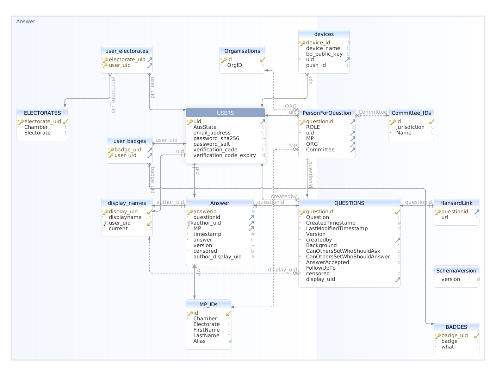

# User Accounts (WP1A)

This report provides a review and recommendations for user management in Right To Ask (RTA). It will cover the following:

* Back-end structure
* Types of accounts and their respective needs
* User registration
  * Including local and federated login
* User Verification
* Account recovery
* Support for E2E DMs
  * Including support for the future implementation of push notifications
* Account Moderation

## Back-end Structure
The current implementation as the following schema for a user:
| Field Name | Field Type | Comments |
| ------------- |:-------------:| :-------------: |
| UID | VARCHAR(30) | PRIMARY KEY NOT NULL
| DisplayName | VARCHAR(60) |  |
| AusState | VARCHAR(3) |  |
| PublicKey | TEXT NOT NULL | For bulletin board access

### Multi-Device Support
Currently the back-end has only partial support for a single user having multiple devices. This is because each user can only have a single PublicKey associated with it. Multiple devices could only be supported if the key pair were synchronised across the devices. This is both difficult to do securely and if the key is eventually stored in a SecureElement will be impossible to do.

> **Recommendation 1**: The user schema should only contain data that is about the user and should not contain device data. Instead, create a Devices table which is linked to a user via the UID. This allows a one-to-many relationship between the user and their devices. This will also be required to support E2E DMs and Push Notifications, both of which will require device specific identifiers to be stored against a user.

### UID
Currently the UID is equivalent to a username, for example, a handle or email address. Any user selected value should be anticipated to need to change, even if not fully supported on the front-end. For example, if a user selected UID contained a racist term or a swear word. Moderation may looks to remove that from the UID, which would present a problem if that value is being used throughout the database.

> **Recommendation 2**: Change UID to be an internal-only UID that is not displayed to the user. It should be auto-generated to guarantee uniqueness and permanence, i.e. it never changes. As such, UID should be changed to ``INTEGER AUTOINCREMENT``. Any corresponding uses of UID in other tables would also need to be updated.

### Foreign Key Constraints and General Database Structure
The current database schema does not always set primary or foreign key constraints. Such constraints help to maintain both referential integrity, as well as having a possible performance benefit. Specifically, the information provided via key constraints allows the database to optimise linking queries, as well as the searching of tables via the primary key. It also allows the ``ON DELETE CASCADE`` property to be configured. This will automatically delete tables that reference the primary key when deleting the record containing the primary key. For example, deleting a user will delete any badges that are associated with that user. This is not automatic, and could be selectively applied. For example, it might not be desirable to delete a question when deleting a user. Although that does need some consideration.

> **For Consideration**: What should occur when a User is deleted or requests to be deleted. Should all of their data be deleted or should only personal information be deleted. Note: this does not impact on whether key constraints should be set, it just impacts on whether a ``ON DELETE CASCADE`` constraint is set.

VT: I'd be inclined not to delete their questions unless we have to - otherwise someone can maliciously gather lots of up-votes (and dissuade others from writing the same question), then delete their account. I am not sure whether some people would feel that the right to deletion is important - we should certainly communicate clearly that you can't delete your questions even if you delete your account.

AC: Foreign keys are good, no question. They are a constraint, so I think that it is an issue for what happens when a user is deleted, assuming we keep the questions (as seems reasonable). In particular, we may not want a foreign key for some of the users mentioned in questions - or else we could put in a stub user whenever a user is deleted.

CJC: One option would be to have a single stub *deleted* user. Then prior to deleting the user the UIDs referencing them from questions, or any other table, are replaced with the UID for the stub *deleted* user. If constraints aren't enforced it could make querying more complicated as it will likely need multiple queries rather than a single linked query to handle missing users.

Whether the primary key should be just an auto-incrementing integer or a UUID is open to some debate.

#### Should a UUID be used as a primary key?
There is some debate about whether UUID's are more desirable than simple integer keys. The advantage of a UUID is that it is globally unique, as such merging databases is possible without the problem of key duplication. Furthermore, if sharding a database across multiple servers UUID will prevent key collisions. Some argue that is offers security benefits, in that a standard auto incrementing integer is susceptible to index attacks, i.e. ID=10 leads to it being obvious that ID's from 1-9 should be tried and 10+. A UUID prevents such simple indexing, but their value against brute-force attack are dependent on how they are constructed.

MySQL contains a UUID function that generates a Version 1 UUID, which is based on MAC address and time in nanoseconds. As such, there is no 'randomness' to speak of, just a rapidly changing clock. Therefore the indexing attack is not over the entire space, but is in fact bounded by the rate of change caused by the clock. Whilst there is likely to be a security benefit, quantifying that benefit is problematic and therefore should not be relied upon to provide any meaningful protection. If the system is not secure with Integer keys it isn't secure with UUID keys.

The biggest drawback of using a UUID is that they require considerably more space to store and are potentially difficult to debug and use. For example, a UUID is 16 bytes, whilst an Integer is only 4 bytes. The most efficient way to store a UUID is as a Binary field, however, this requires converting it to characters and to be human readable, and therefore displayed in any debug logs or used directly in any debug queries.

For a Minimum Viable Product (MVP) there are not sufficient compelling reasons to recommend a UUID. For simplicity a standard auto incrementing integer will suffice.

#### Database Structure
The current database structure is as follows:

Note that no relationships are defined between tables, despite them existing within the schema. This can be resolved with correctly configured key constraints.

The following diagram shows an updated diagram with the relational links added, as well some deduplication and some additional fields in the User table, which will be discussed in further detail later in this report. Additionally, there are placeholders for a devices table and the PublicKey has been shifted to the device record.



Whilst this may look like a lot of changes, most of it is the addition of foreign key constraints. Additionally, linking tables for badges and electorates have been added. Previously each Badge would duplicate the content for each user, when in fact the badge is static and is just awarded to the user. Similar to electorates, there is only one electorate that each user should reference, instead of each user having an entry for that electorate.

AC: Agreed entirely about deduplicating electorates and foreign keys. I am not so sure about badges, as there (at the moment) is very little duplication there so the extra references would take more space (and complexity) than the occasional duplication. Now that may change with your proposals for changing what badges are used for - e.g. adding registration status. Although I feel that that is a small enumeration that is probably better off as being a field of the user structure for efficiency.

CJC: If badges are used for things like moderation, and registration status, and MP and Staff designation I would suggest deduplicating them. It will make finding all users of a particular type more efficient. You could enumerate them in the database, but that more tightly couples registration logic into the database structure. 

Changes to the existing structure could be achieved using Database Management software like [DBSchema](https://dbschema.com/), from which the entity relationship diagrams were created. The paid version of DBSchema offers functionality to generate migration scripts. These work by first importing the existing database schema, making the necessary changes, and then exporting the migration scripts. These scripts should handle both the updating of the database structure as well as moving the data over to it. It would need testing in practice, but might provide a starting point for migration. If the database can be discarded and re-initialised, i.e., it is still in testing or development then that would be easier and the more advisable option.

AC: Much of this will be straight forward, the most tricky thing being the deduplication which shouldn't be that bad.

### User Table
The User table has been modified to convert the UID to an auto increment integer. A new field has been added to hold the email address, irrespective of whether it is added manually or retrieved from a federated login. A password_sha256 field has been added to handle local logins. This should contain a 32 byte verification value calculated using the password_salt. Whether the salt is returned to the user for local calculation or the salted hashing is performed on the server remains to be decided. It is possible that these fields are blank depending on how registration is performed.

The verification_code and verification_code_expiry contain the last randomly generated verification code sent to the user. The expiry should be a time, for example, 30 minutes after the code was generated. When checking the code, if the current time exceeds this expiry the code should be rejected. [_**Note**: implementing this requires careful consideration of daylight saving time if the clock being used for comparison changes with daylight saving time. It is generally easier to use UTC instead of a local timezone for such comparisons. Unix time is derived from UTC, so provided no time zones are applied it should be fine_]

AC: Shudder. Very much agreed about UTC. I try *never* to use local time on a server as it always causes problems. Occasionally I stuff up and accidentally use a local time.


### Sessions
Currently there is no concept of sessions within the back-end or the client app. Traditionally, apps would establish a session with the server through logging in, which would return some form of bearer-token that could be used to authenticate all subsequent requests until the session expires. By contrast, RTA uses the signing of messages as a means for authentication. This is sufficient when dealing with a very limited API, for example, adding a question, accepting an answer etc., however, it presents a problem for user account management.

For example, if a user wants to change their display name or email address it will be necessary to authenticate both the request to view the current data, and any follow-up requests to change it. It is possible that these requests could be signed as well, but that will make the processing of such requests more computationally expensive due to the signature checking required.

Currently this is not a problem because of the single device architecture However, once multiple devices are supported it will be necessary to synchronise such data on start-up, since it could have been changed by another device.

VT: The way it's implemented at the moment is that existing data is stored locally and change requests are signed. Agree this may be a computational burden.

AC: The signed versions are needed for many API calls so that it can be put on the bulletin board. Possibly everthing that is signed at the moment. This is likely to change in the moderate future, but the gains from sessions seem small in the near future so I don't think this is as high a priority as most of the other things.

CJC: agreed, it is not a high-priority, not least because the fallback is always signatures. I suspect the number of API calls that will be non-bulletin board calls will start to grow rapidly, particularly post MVP - user management, moderation, synchronisation, etc. I'm also assuming the database is MySQL and using InnoDB, if it is MyISAM the table locking will be a problem very quickly and probably needs addressing now. Either way, not having sessions will significantly increase database load due to the repeated querying of the user table. There is also a security argument, in that without sessions replay attacks become easier. An attacker with a copy of a previously signed submission can replay it and have it accepted, there is no liveness test. If a TLS based session approach was adopted you know the client must have had access to the private key at the point the TLS session was started and cannot replay anyone else's submissions without also having their private key to establish a live TLS session. 

One option for establishing sessions would be to use Mutual Authentication of the TLS connection. The server could act as an internal Certificate Authority that signed certificate requests from the client. As such, when a user registers and generates their key pair they also generate a certificate signing request which is signed to create a certificate including their UID and their device_id.

### TLS
The current approach to TLS on the server is to have an nginx server that acts as the end-point and then locally redirects requests to Rust. This has some advantages, in that it would allow load balancing by redirecting to different instances. However, the downside is that the end-point occurs prior to the Rust server and as such some additional configuration is needed to access the certificate. The simplest approach is to forward the necessary data via proxy headers, for example, by enabling:

`proxy_set_header X-SSL-Client-S-DN   $ssl_client_escaped_cert;`

This will include an encoded copy of the verified certificate in the headers, which Rust can then extract use to determine the client ID.

It is not always necessary to send the entire certificate. It is possible to extract various parts from the certificate for efficiency using headers like the following:

```
proxy_set_header X-SSL-Client-Serial $ssl_client_serial;
proxy_set_header X-SSL-Client-Verify $ssl_client_verify;
proxy_set_header X-SSL-Client-S-DN   $ssl_client_s_dn;
```

The Rust process to check that `X-SSL-Client-Verify=="SUCCESS` which determines if the mutual TLS was successful. Note, this will be essential because nginx may need to be configured to allow failed mTLS connections through for some requests, as such, `X-SSL-Client-Verify` may not always be SUCCESS.

AC: Also there are some normal-browser stuff that won't have client certificates, such as the web question view (to enable people to generate links to questions in other things).

CJC: This is a good point, ideally that should be fairly well defined and limited - assuming there isn't a browser based variant.

The reason failed mTLS connections may need to be allowed through is to allow the initial registration request through, in which the mTLS has not yet been configured for that client. An alternative, and better albeit more complicated option would be to configure different locations with different settings. One would be specifically for registration in which failed mTLS connections would be accepted and passed on to Rust. Whilst the general location for all other requests would enforce successful mTLS and reject any connections that fail. For redundancy the `X-SSL-Client-Verify` should be checked in any case to protect against nginx misconfiguration.


#### TLS Sessions
TLS sessions would work by extracting a unique ID from the client certificate and using that as the index to a session store held on the server. Note, it is advisable to use a device specific identifier, not a user identifier. Otherwise a user accessing the service with two different devices will create a session collision, i.e. they will have one session shared between them which will create problems for future functionality like pagination. A good option would be to use a double index in the session store. The first level would be the user ID, extracted from the certificate DN, and the second would be the certificate serial number, which is device specific due to different certificates being used on each device.

I would suggest implementing the session store using [memcached](https://www.memcached.org/). This provides a key value store, which is supported in [Rust](https://docs.rs/memcache/latest/memcache/). It provides object storage as well as providing an expiration time for entries. As such, there is no need to explicitly manage clean-up, memcached will handle clearing expired sessions for you.

Data that is stored in a session is not persistent, it will be lost during a server restart or after expiration. The expiration should be long enough to cover the vast majority of use cases and will be dependent on how the app reloads. For example, how long should a search pagination last between requests, 30 minutes, 1 hour, 24 hours? Any such usage of a session cache should be written to gracefully fail should the session disappear, for example, during a server restart.


_A related conundrum (though not necessarily one with the same solution) is pagination of the questions - how does the server know which questions it has already served to which users, so as to avoid repeating them? At the moment, it doesn't - it just returns them all, but this will become infeasible as the number of questions grows large._

## User Accounts

### Need for accounts
Unfortunately one of the few things you can guarantee with the internet is that if you allow people to post content, someone will post content they should not. Whether that is illegal content, harassment, spam, distribution of malware, or one of the many other possibilities, the ability to reach an audience will eventually be noticed by miscreants and subsequently targeted. As such, a completely open system is likely to become unmanageable quickly, and in turn may detract from the true purpose of the site and discourage genuine users. That said, the opposite is also a problem, if the creation of accounts is too arduous, it may cause too much friction and result in prospective users not engaging with the site. What is required is a minimum viable account system, whereby the minimum is determined by the moderation requirements of the site.

It should be noted that this method of determining the minimum viable account system is specific to this context. In other contexts there may be additional requirements, for example, in finance there will be Know Your Customer requirements, in online shopping there might be delivery or payment requirements. However, in this context the primary objective is moderation and as such will be the factor we use to determine the minimum level of account system.

### Types of User Account
The following user account types will be defined:
1. **Basic** - The initial account type, no registration is required but extremely limited in functionality
3. **Registered** - Intermediate account type that has no greater permissions, but has started the registration process by providing their email address
5. **Verified** - Verified account, their email account has been verified and they now have full standard user account privileges
7. **Verified Secondary** - Extended standard user account that has been linked to an MP's account, either via email verification or direct approval TBD
9. **Verified Primary** - Verified as a parliamentary MP account via email

AC: Badges at the moment are for MP primary or secondard, or organisation. One might have multiple ones of these, so a user could be multiple 3/5/7/9.

Accounts effectively have escalating permissions with type. i.e. Basic can view but that is it, registered is an internal only status to handle the transfer from registered through to verified.  Note that most people will spend almost no time in the state of registered but not verified. Indeed, it may not even be helpful to think of this as a separate state from 'basic'.

There may be added "privileges" or badges associated with an account, but they do not need to change the definition of an account. For example, a user could self-submit their electorate, which would define the electorate in the database. However, there is also the possibility of distributing QRCodes within electorates to allow a user to verify their electorate. The best approach to this would be through the use of badges, and having the issuing of badges distinct from user account management.

Overall, badges would provide an easy way of defining the different types of account and allow easy adding and removing of badges. However, the current code for managing badges may need some minor updates. The existing code in [person.rs](https://github.com/RightToAskOrg/right_to_ask_server/blob/main/right_to_ask_api/src/person.rs) does not handle checks and updates in a single database transaction. It does not look like this would cause a critical failure, but it could in theory create some concurrency issues.

For example, it appears the following code checks if the badge is in the database in one transaction and then stores the badge in the database in a second distinct transaction. There is no guarantee of consistency between the first `is_in_database` result and when the `store_in_database` is called. It is likely that the first check could be combined into a single query. If not, then a single transaction should cover both queries to maintain consistency.

```
if badge.is_in_database(&initial_request.signed_message.user).await.map_err(internal_error_email)? { return Err(EmailValidationError::AlreadyHaveBadge); }
	badge.store_in_database(&initial_request.signed_message.user).await.map_err(internal_error_email)?
```

It appears that the queries run for these two functions are as follows:
```
select COUNT(UID) from BADGES where UID=? and badge=? and what=?
```
and
```
insert into BADGES (UID,badge,what) values (?,?,?)
```
In the updated recommendation structure this could be combined into a single insert query:

```
insert into user_badges (user_uid,badge_uid) values (?,?)
```

Where the `badge_uid` represents the type of badge being added, i.e. "Registered", "Verified", etc. These are shared types, with the mapping occurring in user_badges. As `user_uid` and `badge_uid` are composite primary keys any attempt to insert a duplicate would be rejected, thereby not requiring the guard query to check if it already exists.

AC: I have tried to do things in a single transaction where possible (although may have stuffed up). Unfortunately there is a terrible issue with the bulletin board. Do we change the database before or after posting the change to the bulletin board? Ideally the bulletin board should have a rollback tied into the SQL transaction, but this makes it hard to separate the bulletin board from the main server db, which is a nice property. So I have tended to have first check to see if the query looks legal, if so post it to the bulletin board, and then try to actually do it, which may now be illegal again. So some of the legality checks are duplicated in a different transaction. Then we could (but currently don't) publish a repudiation to the bulletin board if it failed.

CJC: Why not optimistically change the database? The database is easy to revert, whereas the bulletin board is difficult. If the bulletin board fails you can delete the database entry or try again.

### Permissions
The following defines the different permissions the different users will have.

| Account Type | Read Posts | Create Posts  |  Upvote/Dismiss  |  Answer Questions | Flag Posts  |  DM  | Authorise Delegate Account | Act as Delegate Account
| ------------- |:-------------:| :-------------: |:-------------: |:-------------:|:-------------:| :-----:|:-----:|:-----:|
| Basic  	| :ballot_box_with_check: | :negative_squared_cross_mark: | :negative_squared_cross_mark: | :negative_squared_cross_mark:  | :negative_squared_cross_mark: | :negative_squared_cross_mark: |  :negative_squared_cross_mark: |  :negative_squared_cross_mark: |
| Registered  | :ballot_box_with_check: | :negative_squared_cross_mark: | :negative_squared_cross_mark: | :negative_squared_cross_mark:  | :negative_squared_cross_mark: | :negative_squared_cross_mark: |  :negative_squared_cross_mark: |  :negative_squared_cross_mark: |
| Verified | :ballot_box_with_check: | :ballot_box_with_check: | :ballot_box_with_check: |:negative_squared_cross_mark:  | :ballot_box_with_check: | :ballot_box_with_check: |  :negative_squared_cross_mark: |  :negative_squared_cross_mark: |
| Verified Secondary | :ballot_box_with_check: | :ballot_box_with_check: | :ballot_box_with_check: | :ballot_box_with_check: | :ballot_box_with_check: | :ballot_box_with_check: |  :negative_squared_cross_mark: | :ballot_box_with_check: |
| Verified Primary |:ballot_box_with_check: | :ballot_box_with_check: |:ballot_box_with_check: | :ballot_box_with_check: | :ballot_box_with_check: | :ballot_box_with_check: | :ballot_box_with_check: | :negative_squared_cross_mark: |
 

> **For Consideration**: Should a Registered account be able to Flag posts? The argument against is the creation of fake accounts and spamming the moderators. The argument for is that if you can read something that causes you offence, should you have to verify yourself to flag it? It might be better to allow flagging easily but weight unverified user flags lower that verified user flags.

VT: I changed 'Flag post' permission for plain Registered, so that it perfectly matches 'basic.'

VT: At the moment the authorisation for delegate accounts (or rather the acquisition of the badges) is through a 6-digit PIN sent in email. Certainly like the idea of possibly endorsing directly in the app though.


### User Account Structure
* DisplayName (free text, no emoji, non-unique)
* uid - internal random userID - not changeable
* handle (no spaces, equivalent to twitter @, unique)

Account type and moderation status will be stored via badges.
* AccountType - int (basic, registered, verified etc)
* ModStatus - default 0 (1 premod, 2 banned)

Handle needs to be unique, so people can for example establish a DM exchange using handle as an index to the internal ID. It is likely that changing the handle will be a requirement, although hopefully a rare one. The question is how to handle that:
* Should handles be available for reuse if someone no longer uses it, i.e. they changed their handle, does their old handle become available for use?
* If old handles are made available should there be a time delay before they are available for use? If so, how long?
* If not, should all handles associated with an account be permanently associated with it, i.e. if someone tries to initiate a DM key exchange with an old handle should it work? I can see problems with this in that it would reveal old handles. That might be an issue depending on why the handle was changed. Let's imagine it was an offensive handle or at least accidentally offensive, history of that might want to be forgotten. Alternatively are old handles simply retired?
* If retiring or permanently associating handles should there be a limit on the number of changes? I.e. 3 changes to prevent user handle squatting.

Handle should not be position specific, i.e. VicHealthMinister, instead they should use BobSmithMP and have "Vic Health Minister" as their display name.

Changes in handle do not need to be tracked. Existing DMs will  be using the UID internally, so won't be impacted. As such, the handle should be considered purely as a directory index, not as a direct address.


### Changes in DisplayName
If DisplayName is not used for indexing uid for DMs, the changing of a DisplayName is potentially easier than changing a username. However, this does present a challenge for previously asked questions. It is necessary that where DisplayName can be changed, the DisplayName that existed when the question was asked or answered needs to be shown. In the original design this isn't a problem because each question explicitly stores the DisplayName, however, that is not efficient and presents challenges in tracking when a user has changed their DisplayName and in terms of moderation.

A preferred approach is to store a record of all DisplayNames and link to the appropriate DisplayName ID that was used when the question or answer was created. This will allow the UI to show both the original DisplayName as well as the current DisplayName of the user. The UI for that will need consideration.

When moderating DisplayNames, for example, to remove offensive terms, the DisplayName should be edited as opposed to replaced to ensure it is not shown in historic questions. Such changes should be restricted to moderators only. Standard user triggered DisplayNames should result in additional rows being constructed and the appropriate ID updated. This is reflected in the new database design.

If a user changes their email address their verification status is reset. They should be warned about this before starting to make the change. Email addresses should be unique and limited to one user per email address. How to handle sub-addresses, for example, + addressing in Gmail, is a moderation decision.

### Badge Types
Badges will be globally defined instead of creating a badge per person for the same thing. i.e., there will be one Registered badge and one Verified badges in the badges table and then they will assigned to multiple users. The badges table is defined as follows:

| Field Name | Field Type | Comments |
| ------------- |:-------------:| :-------------: |
| badge_uid | INT | PRIMARY KEY NOT NULL
| badge_name | VARCHAR(30) |  |
| what | TEXT |NOT NULL   |

This is slightly different to presently, where `badge` is an ENUM, which is not necessary as the badges table becomes the ENUM in the new structure. `badge` is replaced with `badge_name` , which is a human readable name for the badge.

The initial badges would be:

| badge_uid | badge | what |
| ------------- |:-------------:| :-------------: |
| 1 | basic_user | Basic User badge |
| 2 | registered_user | Registered User badge |
| 3 | verified_user | Email Verified User badge |
| 4 | MP | Denotes user is an MP |
| 5 | MP Staff | Denotes user is a staffer for an MP |
| 6 | Admin | Denotes user is an admin |
| 7 | no_mod | Denotes the user is not currently subject to moderation |
| 8 | pre_mod | Denotes the user is currently subject to pre-moderation |
| 9 | banned | Denotes the user is banned|

Note, that when moving between user states, i.e. registered_user to verified_user, or no_mod to pre_mod, the change must be performed in a single SQL transaction. For example, if the no_mod badge is to be removed and the pre_mod badge added the DELETE on the no_mod badge for that user and the insert on the pre_mod badge for that user must occur in a single atomic transaction to ensure inconsistent states cannot occur through failure or server crash.


## User registration
The default login approach, which will need to be provided irrespective of Social Login, is for RTA to establish and verify identity. The simplest approach to do this is to user email address and a verification email to check the user has access to the claimed email address. There are alternative ways of establishing identity, including phone number, and device IDs, some of which are detailed later. However, the most conventional is to use an email address. The only reason this might need to be extended is if moderation becomes a problem caused by individuals creating multiple accounts, however, for the moment we will assume that is not a problem.

### Is a password required?
In an app only environment a password might not be required at all. For example, if authentication is achieved through the identity key pair, then why use a password at all? Many apps are moving towards a passwordless setting, either using PKI (FIDO) or using magic links. Magic links are a term Slack uses for sending login links to a person's email address which when clicked logs them into their account. This may seem less secure, but if a single factor password reset option is provided, i.e., a reset email, then the magic link in an email does not degrade the security of the account. This is because an attacker could always perform a reset request and achieve the same outcome.

As such, there is an argument that no password is required. There is also an argument that passwords that are rarely used can be a usability problem. Password recall is linked to muscle memory, the password you use everyday is easy to remember, the password you set up for an account you haven't used for 12 months is extremely difficult to remember, likely leading to password resets in any case. If the password isn't going to be asked for on a regular basis, then there needs to be a secondary justification for its inclusion.

### What is the purpose of the password?
Where a password can be useful is as a source of entropy for local encryption of data that will be stored on a server. This is similar to current E2E platform backup solutions, using the password or PIN to derive a local encryption key. However, such an approach is dependent on the server not knowing what the password is. As such, if there is an intention to use the password as the input to a Password-based Key Derivation Function (PKDF) the login process has to be different.

In particular, either a more complicated message exchange is required to hide the password, or a derived authentication key needs to be created in addition to any encryption key. For example, generate a 256 bit key and split it into two 128 bit keys, one for encryption, one for authentication. Then submit the random second half of the key as the password. This is a simple approach to the problem but is not the optimal approach.

A more optimal approach would be the [Secure Remote Password Protocol](https://en.wikipedia.org/wiki/Secure_Remote_Password_protocol), which seeks to provide authentication without the server holding the secret. There are various protocols proposed, with varying support. Using such a protocol would require some additional thought as to how to also derive an encryption key, but is within the realms of possibility.

### Can it be decided later?
Switching from a traditional login to a local only login, i.e., one that does not share the password with the server is not a backwards compatible change. Not just in terms of supporting previous apps, but also in terms of security. Once the password has been shared with the server it has zero value as a local source of entropy. As such, if a transition was made from traditional to crypto based all the passwords would need to be reset. This is a problem both in terms of usability, but also could create the suspicion of a hack, even though one had not taken place.

If a password or PIN is required after having adopted a traditional login approach it would be advisable to add it as an additional option, much like Signal does, rather than tie it to app login.

### Traditional Login Requirements
If traditional login is used the password storage on the server should follow industry best practice [OWASP Password Storage Cheat Sheet](https://cheatsheetseries.owasp.org/cheatsheets/Password_Storage_Cheat_Sheet.html).

The verification email should be sent in such a way as to maximise the chances of quick delivery. This may require using a commercial provider. Consider sending such emails from a dedicated subdomain to help distinguish such emails from organisation emails. This is important for email deliverability, in which [Subdomains](https://mailertogo.com/blog/should-i-use-a-subdomain-to-send-email/) are treated distinctly (this isn't always the case, sometimes IP address is used as well, but it can help). As such, create subdomains for different types of email, i.e. security.righttoask.org, notification.righttoask.org, etc. This helps prevent different emails triggering blocks on other types of emails, i.e., if a lot of notification emails are sent they are more likely to get classified either as unimportant or spam, but you don't want your security emails falling under the same category.

The subdomains should be setup and used during development as that will assist in building reputation by sending and receiving emails.

The size of the login code, i.e. 4, 6, 8 digits, should be calculated based on the lifetime of the code and the ability to brute force it. Note that a 4 digit code must always return 4 digits and traditionally starting codes with 0 can be problematic when generating them, since the leading zeros need to be manually added. As such, it may be that a 4 digit code actually only has 9,000 combinations as it will run from 1,000 through to 9,999. Alternative options would be to use 4 random word structures. These are both more secure, with higher entropy - assuming they are randomly generated from a large dictionary - and can be easier to transpose from a different device or share with someone else, for example, in the case of verifying a staffer account.

If random word codes are used suitable dictionaries can be found from the [EFF](https://www.eff.org/deeplinks/2016/07/new-wordlists-random-passphrases).

### Social Login
Social login is a form of federated login that uses social media platforms as identity providers. A number of platforms offer such services, including Google, Facebook, Twitter, GitHub, etc. The idea behind it is that users do not need to create dedicated accounts for each service, and only need to remember a single password - the password for the social media identity provider. Where the social media platform has additional information, for example, first and last name, age, etc. the receiving platform can populate the profile without requiring the user to provide the same information again. Some people believe it has a lower level of friction when compared to creating a dedicated account, although some caution should be attached to such a view, which we will discuss later.

#### Underlying Technology
There are various variants of Social Login, some using proprietary approaches requiring custom libraries (Facebook). Excluding such proprietary approaches, there are two open standards typically found in use by Social Login providers, OAuth and OpenID. Note, Facebook also implements some of the open standards but limits what can be done over the non-proprietary approach, in particular, what data can be collected.

##### OAuth
There are two variants of OAuth, OAuth 1.0 and OAuth 2.0. Describing the differences between the two is beyond the scope of this document, but in short summary, OAuth 2.0 is a complete rewrite to help support more devices and simplify the signatures, as well as provide more fine-grained scoping. However, there has been some criticism of OAuth 2.0, and in fact OAuth 1.0, in terms of the lack of a strict standard and that if a service wishes to make use of OAuth it needs to register with the provider. This is a significant disadvantage as it requires custom code for each supported provider, which was not the original intention.

Fundamentally, OAuth is not an authentication protocol, [it is an Authorisation protocol](https://oauth.net/articles/authentication/). i.e., it allows a user to authorise an application to access some or all of the API as if it was being performed by the user. As such, it is primarily used for accessing resources, for example, accessing a Google Drive, Dropbox account, or sending and reading tweets.

When OAuth is used to authenticate an user it is actually a pseudo-authentication protocol that derives assurance that the user is who they say they are on the basis that the service can access resources restricted to that user. However, it doesn't actually commit to provide any such assurance. It is quite possible that authorisation could have been granted via a browser that was already logged in and therefore does not assure user presence.

In the context of RTA there is a challenge to using OAuth based pseudo-authentication, namely that most such providers will be providing some form of access to resources. For example, Twitter, which provides an OAuth 1.0 end-point allows tweets to be read as part of the "authentication" flow. For a privacy conscious app this is counter intuitive. Additionally, the primary information that RTA requires is the email address, which is sometimes protected more strictly. In the case of Twitter permission must be sought from Twitter to access the email address, requiring registering and complying with a series of policies to be approved. This presents an administration cost and may complicate rolling out new apps, particularly if any of the providers require app reviews (Facebook does in some instances).

As such, it seems reasonable to dismiss using a pure OAuth approach for RTA. This would immediately preclude Twitter and since that is/was one of the primary alternative platforms its preclusion dramatically reduces the return on investing in developing Social Login.

##### OpenID
OpenID provides a true authentication protocol. Its aim is to request the server to provide an assertion that the user is who they claim to be. It can achieve this using various methods, but fundamentally, the protocol is designed specifically for authentication. The most common form of OpenID is OpenID Connect (OIDC) which is OpenID run over OAuth 2.0. In some respects this can be considered to be a two-step process, the user authorises the service to access the Authentication API through OAuth 2.0, and then OpenID protocol authenticates the user.

Support for OIDC is growing, however, each provider requires registration and may have slight differences in how it handles messages. As such, custom code for each provider would be necessary. If Social Login was pursued it should only be via an OpenID solution.

##### Challenges
One of the challenges is how to handle re-login, and how often it should occur. If it is used just during first registration the email address returned and stored by RTA could become stale, and not available for performing recovery. However, the login process is not user friendly, in particular the actual login with the provider has to be performed in a web browser, not within the App. This requires setting up callback URLs to return responses to the App and forces the user out of the app during registration, which may not be desirable.

## User Verification
Email verification can be done via either a link or a code. An email link that can be clicked to approve the registration is commonplace, but the risks of phishing attacks may raise some concerns. If a link is used, consideration should be given for using [App Links](https://developer.android.com/studio/write/app-link-indexing) on Android to allow the verification to be performed using the app rather than the browser. Either way, the UI needs to gracefully handle the verification. If we assume that registration and verification may not happen sequentially the app needs to handle the verification flow from potentially any screen. As such it must consider the following:

* Remember where the user was and what they were doing
* Remembering that the user is likely to switch away from the app to their email client so restore needs to be correctly implemented
* If using links provide either a Push notification to the app so that it automatically moves on from the verification challenge or a button that allows the user to trigger a check that verification has been completed and move on
* Some form of UI symbol should be shown within the app to signify verified status
* For Verified Secondary the process is probably no different, I don't think we can require a parliament address for delegated assistant accounts as the staff may be private staff in the constituency.
* For Verified Primary accounts enforcement of registered MPs email addresses needs to in place

### Delegating to an Account
A Verified Primary account can delegate to a Verified Secondary account through some form of approval process, mostly likely digitally signing a request or through providing a security code similar to verification. It is probably best that such requests come from the Secondary account so there isn't a burden on the MP to perform too many management functions. Once delegated to, the Verified Secondary account should have similar or possibly the same functionality as the primary. Currently it does not have permissions to delegate to further secondary accounts, which seems like a reasonable limitation.

## Account recovery
Account recovery can be split into two functions, regaining access to a previously setup server account, and recovering previous settings and client data. The minimum viable product probably only requires the former, with the latter being nice but not essential.

### Account Access Recovery
The most basic approach to this is equivalent to a lost password recovery process. The user provides their email address - which must match a registered account - and then a reset code or link is sent to them. For consistency this should probably be a code. However, some caution needs to be used in terms of expiring the code if too many incorrect attempts are made. For example, if a 4 digit code were used and the code expired after 3 incorrect attempts, there would approximately a 1 in 3,000 chance of an attacker successfully guessing the code. This is a problem if you have more than 3,000 accounts.

Moving up to a 6 digit code helps, increasing it to approximately 1 in 300,000. However, this will not be sufficient if an unlimited number of recovery attempts can be requested, or there are a large number of users. Rate limiting on reset requests as well will help, for example,limiting it to 3 in a 24 hour period. Under the assumption that the person whose account it is should notice the erroneous reset requests within a day or two. However, this doesn't resolve the issue if there are a large number of accounts (rate limits cannot apply across distinct accounts). This is where a reset URL could be helpful as it allows a cryptographically secure random number to be used as the authorisation token. However, requiring the clicking of links may be undesirable. Possibly increasing the reset code beyond 6 digits could be useful. Or possibly, use a 4 random words approach or similar to increase entropy but maintain usability.

Once the account reset is authorised it should follow the same configuration flow as a new user, i.e. the device creates a new key pair and downloads any available configuration data. It may be useful to notify the user that some information is not synced, for example, the previously dismissed questions, to avoid any confusion. Once DMs are provided there will be a need to warn the user that any messages in transit will be unreadable and that any verified security codes will be invalid for recipients, i.e. they will be warned the code/keys have changed. The standard initialisation process for the E2E DMs will need to be run to populate news keys on the server.

At the end of this the user should have regained access to their account and be able to post and use the service under their previous identity.

Note: If social login is used the email address previously obtained from the platform will be used. If that address is invalid there is likely to be no way of recovering access to the account. If a social login still exists with that email address it would be possible to login via that platform and re-establish identity. However, if a different platform with a different email address is used, the accounts cannot be linked and therefore cannot be recovered. Even if the same platform is used, but with a different email address, it is likely that it will not be recoverable. The exception would be if the platform provides an independent UID for the user that remains consistent and RTA stores it. However, this would require platform specific storage, which is adding additional complexity.

### Account Data Recovery
Recovery of server-side stored data is trivial and a natural part of the syncing, i.e., display name syncing. However, the current design has upvote/dismiss data stored only locally. This presents a challenge in two scenarios:

1. Loss of device
2. Multiple devices linked to one account

The two challenges present fundamentally different problems. A loss of device can only be recovered if the data is stored off the device, i.e. backed-up somewhere else. Storing off-device presents a security problem; how can the data be encrypted in a way that prevents the storage provider, whether that be RightToAsk or someone else, from viewing the contents and breaking the privacy of the voting system. In any case an encryption key is going to be required. The difference between the two scenarios is how that encryption key is generated and used. Once an encryption key has been generated the encrypted data can be stored on the RightToAsk server. In the case of a lost device this would not strictly need to be on a RightToAsk server, it could use platform backup services instead.

#### Loss of device or move to new device
In the case of a lost device, or moving to a new device, one option would be to rely on platform backups. For example, Android provides an (Auto Backup Feature)[https://developer.android.com/guide/topics/data/autobackup] which it claims is end-to-end encrypted using the PIN/Passphrase of the device. In this scenario, provided that the files are stored in the app directory (which they should be) they will be backed-up and restored. However, this restore will only work if it is Android-to-Android. i.e. if someone had an Android phone, lost it, then decided to switch to an iPhone there is no restoration path. Similarly, iOS provides platform back-ups or one could use CloudKit to manually configure cloud storage and recovery. Note, recovery might only be possible if iCloud backup has been enabled, otherwise the key required to recover the data might be lost.

A similar problem can occur on Android. If EncryptedSharedPreferences are used I believe the key is not backed up and therefore the contents are not recoverable. This is sometimes discussed in errors with EncryptedSharedPreferences where the app has to disable auto-backup in order to get it to work.

The issue is that the AndroidKeyStore stores its key in the SecureElement. The key(s) are generated within the element and are non-exportable. Typically, what happens is that there is a master key that encrypts a preference file outside the SecureElement that stores individuals keys (keys.xml). That keys.xml can be included in the AutoBackup, but because the master key cannot be included - since it is non-exportable - the keys.xml cannot be decrypted. As a result, all EncryptedSharedPreferences are inaccessible if the master key is lost, either through a restore or reset. The correct approach is to still enable AutoBackup, but exclude the keys.xml file. This advice is being added to the source code/docs: [doc update](https://android-review.googlesource.com/c/platform/frameworks/support/+/2264122/2/security/security-crypto/src/main/java/androidx/security/crypto/EncryptedSharedPreferences.java). To exclude or include specific files a set of [backup rules](https://developer.android.com/guide/topics/data/autobackup#IncludingFiles) can be specified. 

If you want to store data in the EncryptedSharedPreferences most of the time, but still want to enable back-up, the best option would be to implement a [Backup Agent](https://developer.android.com/reference/android/app/backup/BackupAgent). This allows the app to be called during a backup to customise the data that is backed up. It would then be possible to read the locally encrypted EncryptedSharedPreferences and output the data directly to the backup. The backup should be E2E encrypted by the user's PIN, so strictly speaking the data would remain secure. However, this is additional work in terms of implementation.

Another issue to consider when using EncryptedSharedPreferences is that there are scenarios in which the master key, or any key within the AndroidKeyStore could be reset or lost. This has been an ongoing issue with Android for some time [previous issues](https://doridori.github.io/android-security-the-forgetful-keystore/) have been detailed. On newer version of Android there shouldn't be a problem provided the key isn't explicitly linked to user authentication and isn't explicitly set to be encrypted - see the comments in the previous issues link. This is where things get challenging for backwards compatibility, if targeting pre 23 APIs AndroidKeyStore is not recommended at all.

However, in theory, the current setup would allow device recovery, assuming voting data is not stored in an EncryptedSharedPreferences/SecureStorage location on the device.

Note also that Apple has recently announced that it too will move to E2E encrypted back-ups, resolving one prior concern ([Apple Announcement](https://www.apple.com/newsroom/2022/12/apple-advances-user-security-with-powerful-new-data-protections/)).


#### Alternative Options

##### How does signal do it?
Signal backs up configuration data using a combination of a PIN, a secure enclave on the server, and a limit on the number of incorrect tries. Whilst a neat solution it is clearly beyond the scope of what would be possible for RightToAsk at this time. (Secure Value Recovery)[https://signal.org/blog/secure-value-recovery/]

##### Generate a Key from a PIN/Password
The simple approach is to generate a key from a PIN/Password using PBKDF, encrypt the configuration file and store it on the RightToAsk server. Whilst simple, the security of this is limited due to the relatively small amount of entropy. An offline attack from the server is going to be difficult to prevent, particularly in the case of a PIN. If a password were used it may be confusing to users to understand that the password is not recoverable and that if they lose it they will lose access to their backup/configuration. As such, whilst simple to implement, it may undermine the security goals to such an extent to make it undesirable.

Additionally, any bespoke back-up service on RTA servers, using either a password or pin to derive a decryption key, will be materially weaker than Google's or Signal's approach. This is because RTA doesn't have Titan security chips or equivalent available on its servers to protect against brute-force attacks. However, it would allow syncing across devices.

#### Multiple devices linked to one account
This presents a fundamentally different problem as there is an ongoing synchronisation problem. However, by specifying this as a distinct problem it could be added as a feature in the future and use a different methodology to the loss of device recovery. This functionality could be provided by requiring devices to encrypt their data files under the public keys of the other devices registered for their account and then storing that data on the RightToAsk server, so that each device downloads the latest file.

An easier approach might be to provide this as an extension of the Direct Messaging functionality. Have a device send its updated configuration file to all other devices registered using the DM functionality, albeit with a flag to indicate it is a system message and therefore not shown to the user. This would save implementing additional crypto and would remove the synchronisation problem associated with multiple devices potentially updating their configuration files at the same time. In this method they would just be distinct messages and all the recipient needs to do is merge all the received files. (Merging should be fine as the operations are add only, i.e. the server won't allow a device to have both upvoted and dismissed a question - **note this means that the config file should only be appended after an operation is accepted by the server, so if two devices request different options at the same time only one will succeed. This should be default behaviour to ensure consistency between the server and the client. Otherwise a failed internet connection that results in a lost request could lead to the client showing the question has been dismissed/voted on, but in fact that not being the case on the server.**.

#### Suggested Development Plan
* Rely on platform backups initially to allow recovery after device loss.
  * This should not require immediate changes unless EncryptedSharedPreferences are being used
  * Monitor Apple's introduction of E2E backups
* When implementing DMs provide functionality for sending encrypted system messages.
* When implementing Multiple Devices use the DM functionality to send configuration file changes after each update
  * Implement configuration file synchronisation
  * Multiple device implementation may also require signing/approval of new devices by existing devices prior to synchronisation


## Support for E2E DMs
Usage of libsignal as a basis for implementing E2E DMs is advised. Attempting to implement a custom protocol is likely to result in something materially worse and more likely to contain security errors. However, there are disadvantages to using libsignal. Support is lacking, as is cross-platform support, in particular Xamarin. To a large extent the implementation requires a certain amount of reverse engineering to determine exactly what needs to be stored. As such, the current proposed data storage is the current best effort, but may be subject to change as more advanced features are implemented/evaluated, which forms part of a different work package.

The general structure is as follows:


Much of it is self explanatory, but some fields may require some further explanation. In particular, currently this layout is framed as user orientated, whereas it will need to eventually be device orientated when multiple devices are supported. However, per device, the current layout captures the data storage requirements. Selected fields are explained in more detail below:
* registrationId - is created on the client when first registering the user/device, and is apparently used to detect if the app has been re-installed [https://community.signalusers.org/t/what-are-registration-ids-used-for/1704](https://community.signalusers.org/t/what-are-registration-ids-used-for/1704). However, the explanation is currently lacking, but it appears as if it needs to be stored server-side as it is part of the PreKeyBundle that is assembled on the server.
* identityPublicKey - this is the signal public identity key, which may or may not be compatible with the RTA key. TBC

The remainder are fairly obvious, there are some restrictions on what happens when using a preKey or when updating SignedPreKeys (expires all existing preKeys), but they are beyond the scope of this work package.

### Server Receipt of Key Bundles
The server will need to receive bundles of keys generated by the client and break them into individual keys. This is preferred to storing the bundle as a single blob as the keys within teh bundle will be individually issued to new clients wishing to DM the user.

### Push Notifications
Push Notifications will be implemented using Google Firebase Cloud Messaging (FCM). This will necessitate storing an additional FCM ID used as an address for the device. These are not permanent IDs, they can change over time, as such, the server must be able to update this value when the client notifies it of an updated value. Additionally, the client should implement a notification receiver to be alerted when the FCM ID changes, which can start the app and update the RTA server. This should happen in the background to ensure that in the case of a change in FCM ID the app doesn't become unavailable until it is restarted.

It is possible that the implementation of Push Notifications will be distinct from E2E DMs. It should be relatively easy to implement as it could have uses outside of DMs, as such it would be advisable to implement Push Notifications separately to DMs.

## Account Moderation
This document provides an initial consideration of the need for accounts, how they could be realised and the purposes they should serve. It will initially outline why there is a need for accounts and then establish the properties that would be desirable from an account, with consideration for potential attack vectors.

### Actions to follow up
* Define an acceptable use policy
  * Including a staged suspension policy for accounts that are in breach
* Define a complaints procedure
  * Implement complaints handling back-end
* Determine moderation strategy
  * Implement moderation functionality


### Moderation Requirements
Before deciding what level of moderation will be required some notion of the site's acceptable use policies will need to be established. Some things should be fairly obvious, i.e. posting illegal content is not permitted. However, in a free speech setting care must be taken in determining the exact wording of the policy. The policy needs to be sufficiently robust that it will permit the banning or exclusion of an individual from the site should they breach said policy. In particular, sections detailing harassment, foul language, threatening behaviour should be clearly defined and explained.

Once a policy is determined there are three core requirements for moderation to be effective
* Items in breach of policy can be quickly and easily removed
* Accounts deemed in breach are prevented from posting in the future, either permanently or temporarily
* Direct messaging can be flagged by the recipient

#### Items in breach of policy can be quickly and easily removed
This may seem simple, but can be difficult to deliver as the site scales. There are a number of strategies that can be adopted:
* Pre-moderation
* Reactive Moderation
* Community Flagged Moderation
* Partially Automatic Community Flagged Moderation
* Community Driven Moderation

Whilst these strategies can be used in isolation, it is likely that a combination of different strategies may be more appropriate, possibly with distinct strategies used for different accounts based on past behaviours.

One common feature of them all is the ability to uniquely identify posts and the user who posted it. This exists in the current design due to the signing of posts. However, there is an overall assumption that accounts are largely restricted to one per person and that a single individual cannot have many accounts. If that were  not to occur these moderation strategies, with the exception of pre-moderation, are likely to fail due to the inability to attribute breaches to an individual. If an individual can have many accounts, banning their account will have no impact and they will be able to spam and potentially overwhelm the site with relative ease.

##### **Pre-moderation**
The most extreme variant of moderation in which content is not posted until it has passed moderation. Such a moderation strategy takes the most time and therefore comes at the highest cost. Furthermore, unless content posting is relatively low in volume this approach will rapidly become infeasible as the site grows. As an ongoing site-wide strategy this should be avoided, however, consideration should be given to being able to apply such moderation to specific accounts, for example, accounts with a certain number of past breaches could be placed in this state for a period of time to try to modify behaviour of the user without outright exclusion.

It should also be considered whether a site-wide setting is implemented for emergency use. One should consider what would happen if the site came under a sustained and co-ordinated attack that attempted to spam it. This could happen were there to be an oversight in some aspect of authentication or overall moderation strategy. Having the option to enable a site-wide pre-moderation flag could be a useful last resort to prevent the site becoming overwhelmed.

##### **Reactive Moderation**
Relies only on moderating content when someone files a complaint. A complaints procedure should be defined, with some consideration for appeal or right to response for the accused account. A decision as to whether to immediately hide a post that has received a complaint should be considered, and if implemented should be detailed in the acceptable use and complaints policy. Some limit on the number of upheld complaints that are permitted and the staged consequences should be made clear to users.

A Reactive Moderation strategy will likely be fairly lightweight, and would hopefully only be required in exceptional situations. However, there is a risk that some undesirable behaviour will go unreported and could lead to genuine users disengaging rather than filing complaints. The risk of this happening will increase the more arduous the complaints procedure is. However, if the complaints procedure is too easy, i.e. just clicking a button, there is a risk of an increase in spurious complaints and the corresponding workload associated with them. If an extremely easy complaints procedure is implemented this becomes more akin to one of the *Community Flagged* variants described below.

##### **Community Flagged Moderation**
A Community Flagged Moderation strategy relies on the community as a whole flagging content as potentially inappropriate. Flagging is intended to be simple and quick, often just a button press. Reactions to flagging can be adaptive, i.e. order items by the number of flags and address those items with the most flags first or above a pre-determined threshold (Note the exact threshold should not necessarily be declared, but the usage of a threshold should be).

The ease of flagging does run the risk that spurious flags will be raised, leading to time wasted reviewing and addressing them. It would be possible to have a consequence for flagging content that is subsequently deemed acceptable, but caution should be taken around applying such measures. If there is a perceived cost to flagging content genuine users may be more likely to not engage in the flagging process. This could result in genuine cases to be lost in the noise from any spurious or politically motivated flagging.

##### **Partially Automatic Community Flagged Moderation**
This adds some degree of automatic response to the Community Flagged Moderation through automatically hiding content or suspending an account when certain thresholds are reached. A right to appeal should be made available for those whose posts have been hidden or accounts suspended. In such a strategy the moderation is potentially largely automated, with moderators only getting involved in the most serious cases where additional complaints are filed, or where there are appeals against moderation.

For example, a threshold of 10 flags could be defined, after which a post will be hidden. The user whose post was moderated should be notified with details of the appeal process - which should be relatively easy to complete, for example, a simple form with a textarea to explain why they believe the moderation to be incorrect.

This could be expanded to automatically suspend or place an account into pre-moderation once a certain number of posts have been moderated within a given period, say 3 months. As such, if a user has 3 posts moderated within a rolling 3 month period their account will enter pre-moderation until they drop back below the threshold, i.e. after a past indiscretion falls outside the 3 month period. This transfer to and from pre-moderation can be automatic, reducing workload. However, this would increase workload in terms of pre-moderation.

Furthermore, there should be a further step available to moderators. For example, posts that fail pre-moderation should be added to the users count of moderated posts and at a certain threshold the account should be permanently or temporarily suspended outright. This is important to provide a limit on the amount of work a problem account can create in terms of moderation.

##### **Community Driven Moderation**
Community Driven Moderation is similar to that found on sites such as Wikipedia, in which the moderation is largely performed by the assigned editors or moderators. Some form of community appeal process can be defined and the administrators of the site are largely hands-off except in exceptional circumstances. Whilst this provides the least work, and potentially scales with the site. It is dependent on having a sufficiently large enough community, with diverse opinions and backgrounds to provide a balanced moderation group. It is possible for administrators to lose control of moderation if community moderation is formally defined. In such scenarios a bias in the moderation team could lead to undesirable results. Heavy handed administrators overriding or interfering with moderation could also cause moderators to withdraw. As such, whilst this is a desirable end goal in terms of sustainability, it should only be evaluated once a sufficiently sized community has been established and the capability of the community to behave in a balanced and fair way has been established.

That said, if this is the long-term goal it may be worth considering how the moderation functionality is implemented in the back-end to create some notion of a distinction between a moderator and an administrator, even though initially they may be the same. This would facilitate an easier transition to this approach later on, without re-engineering the user system.

#### Accounts deemed in breach are prevented from posting in the future, either permanently or temporarily
Fundamentally this is where the real challenge and trade-off begins. Ideally an account should be tied to an individual, and therefore synonymous with each other. Restricting an account should equate to restricting an individual. If it does not, then the individual can just create a new account and circumvent any restrictions. In doing so they render the moderation strategy considerably weaker, possibly undermining it entirely, and lead the site vulnerable to being overwhelmed in terms of moderation workload or inappropriate content.

Establishing identity and linking it to an account is a challenge. At its most extreme it would involve using digital ID services to establish ID to a very high degree of certainty. However, such measures are likely to be deemed too expensive to operators and too invasive to users. Therefore a proxy for identity needs to be found.

##### **Proxies for Identity**
A proxy for identity needs to be something that is typically tied to just one individual, and for which there is some limit or cost in acquiring. No proxy is going to be perfect, there is likely to always be a way around any limits imposed by the proxy given enough time and money. Some possible proxies for identity:

* Email address
* Phone number
* Credit card
* Device ID

###### *Email Address*
Email address is one of the most common and obvious choices. Most email addresses are tied to an individual and many providers, including Google and Outlook, impose some degree of restriction on the number of email accounts a person can create. This is often through identity checking when opening a new account. However, there are plenty of anonymous mailbox services (e.g. mailinator) or someone could use their own domain. As such, some statistics and alerts should be set to detect multiple accounts coming from the same domain. That could be innocent but some oversight might be necessary. Blocking certain temporary email account services might also be a sensible limitation.

Consider some rate limiting based on domain. e.g. unlimited for outlook, gmail, .edu.au, .gov.au, but perhaps rate limit new accounts from other domains, or at least raise an alert if they happen. Put in place some options for detecting how many people are registering from the same domain, how many flags have been raised about them, how many questions they're posting, etc. One indication of trouble is posting lots of questions, or sending lots of DMs, but not upvoting. Or just limit the number of questions each account can ask. Maybe send admins an alert if rate limits are imposed. The rate limits should probably be public.

An email address can only work as a proxy if the email address is verified. Otherwise someone could use an email address that does not belong to them. Limiting functionality until the email address has been verified would be one way of addressing this requirement without adding too much additional friction. For example, DMs and posting can only be made from an account with a verified email address.

As a further note of caution, Gmail potentially allows an unlimited number of email addresses per user through the use of "+" addressing. This works by allowing anything to be placed after the genuine address with a "+" symbol. For example, if the email account is joebloggs@gmail.com, then joebloggs+temp123@gmail.com, joebloggs+temp124@gmail.com and joebloggs+facebook@gmail.com are all legitimate aliases. As such, when checking for uniqueness of an email address it is important to consider such "+" addressing for Gmail and other providers.

###### *Phone Number*
Phone numbers, in particular a mobile phone number, which can be verified via sending a one-time code, provides a high degree of identity verification. This is particularly so in Australia where there are strict identity checks on mobile phones. Apps like Signal use phone numbers as an identifier for individuals. There is a cost involved in sending verification messages and there could be some hesitation from individuals to share their phone number with a website.

###### *Credit Card*
Whilst a credit card is a strong identity check it is not practical for a setting which does not involve purchasing.

###### *Device ID*
Given the mobile nature of the service, in that it is currently only accessible via an app, it would be possible to use a device identifier. For example, `Settings.Secure.ANDROID_ID` is a device/application specific identifier. It remains the same between uninstall and reinstall if the package stays the same and the same signing key is used on the APK. See [Android blog](https://android-developers.googleblog.com/2017/04/changes-to-device-identifiers-in.html). The ID will reset during a factory reset.

If combined with Android SafetyNet it would be possible to ensure that the device is not an emulator and is a genuine Android device. This would prevent automated generation of fake devices. It would require Google Play Services to be installed, but so would Firebase Cloud Messaging, so that might already be a requirement.

This may require an app permission update if imposed later.

iOS has a similar thing: [identifierForVendor](https://developer.apple.com/documentation/uikit/uidevice/1620059-identifierforvendor) but apparently it resets when the user uninstalls and reinstalls the app. A better alternative is probably to store a unique ID in the keychain - we don't *think* this is going to be auto deleted when the app is uninstalled, but discussion is a [little unclear](https://developer.apple.com/forums/thread/72271) and [not getting clearer](https://developer.apple.com/forums/thread/36442). There's also a [device check](https://developer.apple.com/documentation/devicecheck). But overall keychain is probably the right choice.

A further downside would be if future expansion includes a web based version there would be no equivalent ID value. It would also not assist in account recovery.

###### *Third party login*
Could consider Xamarin.Essentials Web Authenticator. This allows the server to use third-party auth e.g. Google, Apple, FB, MS. Upside: much harder for malicious actors to generate multiple different accounts. Downside: dependent on those third parties. Ideally we'd use them (or an email address) for account establishment at most, and then use the established public keys.

#### Direct Messages
Direct messages will require reactive moderation as well as additional functionality to report the contents as the message in question will not normally be visible to a moderator. In order to counter any attempts to falsely claim a breach of policy, direct messages should be signed by the sender's identity key, and thus provide non-repudiation. However, this doesn't prevent out of context complaints, i.e. taking one message out of a context and complaining about it. Moderators will not be able to access DMs directly, and if one party is claiming a breach using an out of context message then the only option to see the context is to provide the subject of the complaint the option to appeal and share their record of the discussion.

If parts of an exchange are shared with moderators there is a need to define a policy for how that information will be stored, retained, and potentially shared. In a worst case scenario - albeit one that is very unlikely - the contents of a message shared with moderators could become the subject of a criminal complaint and the only people with access could be the moderators. For example, if Person A complains about a DM Person B sent that breached the site policy on profanity Person B might be banned. If Person B appeals, and in doing so shares the full thread revealing Person A threatened person B or racially harassed them, then Person A would also get banned. Person B has still breached the policy, and even though there may have been extenuating circumstances, they may still be banned. The problem would occur if Person B subsequently makes a police complaint. Since Person B is banned they will be unable to access their account, and one would assume the app would fail to load, and thus they would not be able to view their messages. If we want them to be able to view previous messages, without logging in, that is going to add complexity to the implementation. As such, we can assume they cannot access any part of the service, past or present, after a ban. They therefore no longer have access to the evidence of Person A's conduct. However, the moderators would have had access when Person B appealed their original ban.

The challenge this presents is deciding what to do with private correspondence sent to a moderator during an appeal or complaint. Should it be deleted when the appeal/complaint is finalised? Should it be retained for a period of time? What responsibility do the moderators have in reporting any potentially illegal content? As an example of clause see (https://twitter.com/en/privacy#chapter3.3)[https://twitter.com/en/privacy#chapter3.3]

